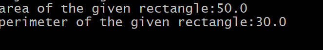

# Experiment-2
## 2a) Title: Create a class methods and invoke them inside main method
## Source Code
``` java
class Rectangle{
double length;
double breadth;
double area(){
return breadth*length;
}
double perimeter(){
return 2*(length+breadth);
}
public static void main(String[] args){
Rectangle rect = new Rectangle();
rect.length = 10;
rect.breadth = 5;
double area = rect.area();
double perimeter = rect.perimeter();
System.out.println("area of the given rectangle:" +area);
System.out.println("perimeter of the given rectangle:" +perimeter);
}
}
```
## Output:

